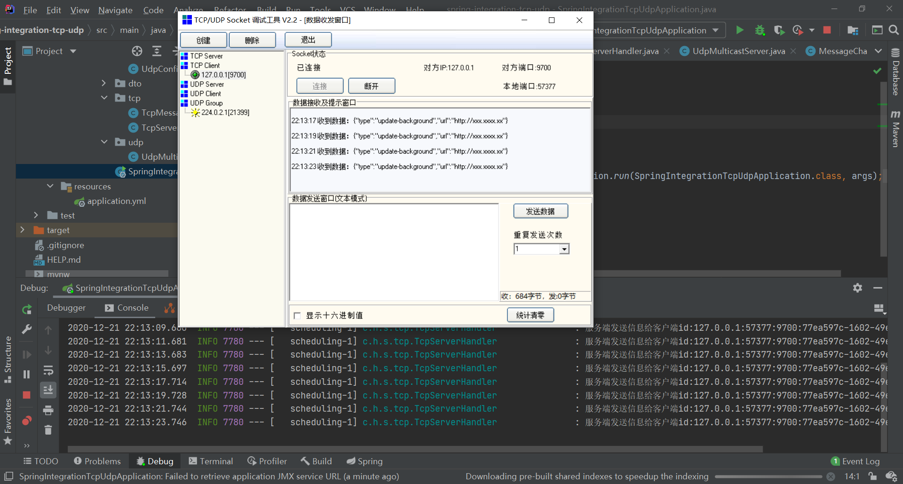
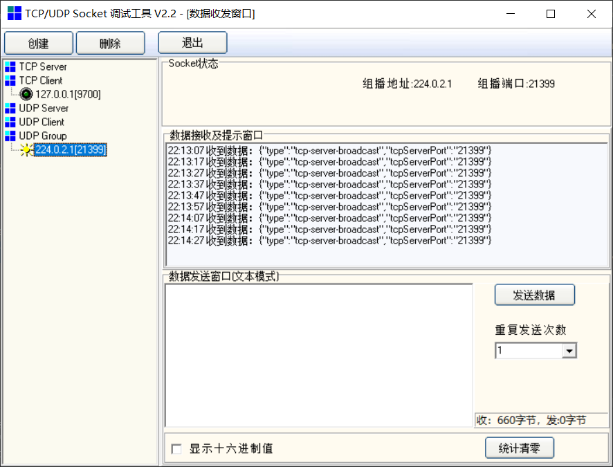

# spring-integration-tcp-udp
使用spring Integration tcp发送消息，udp 发送组播消息

最近需要与单片机通信。使用spring integration 的tcp、udp。
在进行百度、谷歌之后发现使用spring integration tcp、udp的例子很少，尤其是直接使用tcp向客户端发送消息。
在进行查阅了官方文档之后，感觉写的有点模糊。
大概有几种方式：
- 网关 请求响应模式
- MessageChannel，获取客户端的id，给对应id发送消息

主要参考文档：
- spring https://docs.spring.io/spring-integration/docs/current/reference/html/ip.html#ip
- github
- https://stackoverflow.com/ 作者Gary Russell在里面进行了很多相关问题的回答，可以搜索关键字 （spring integration tcp）
  
由于本人非科班，刚上班不久，水平有限，如有错误和建议，还请不吝赐教。
等有空了再补注释吧...

效果图：

tcp:

udp:

Gary Russell(大家有什么问题可以直接在stackoverflow里面搜索)

